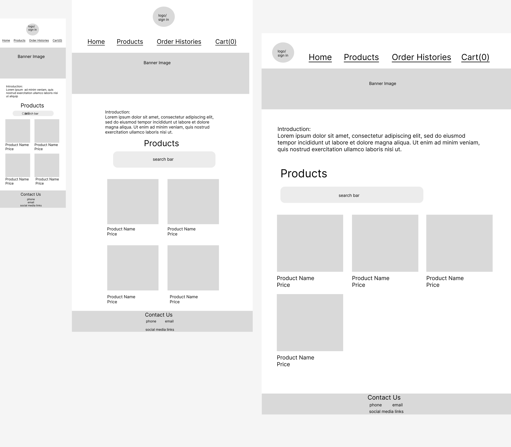
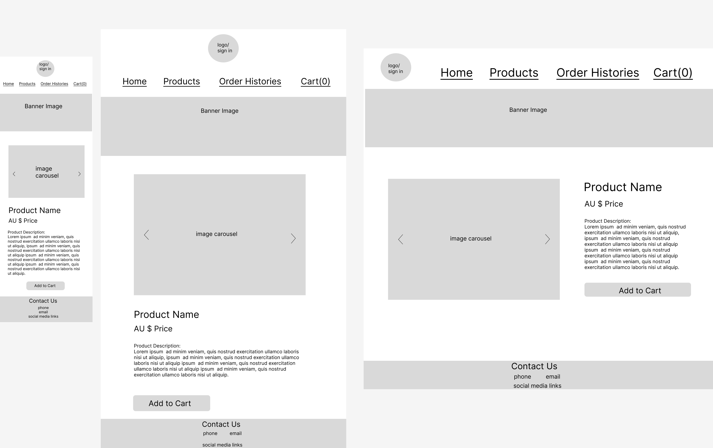
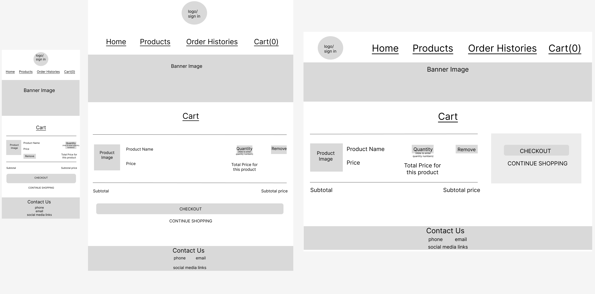
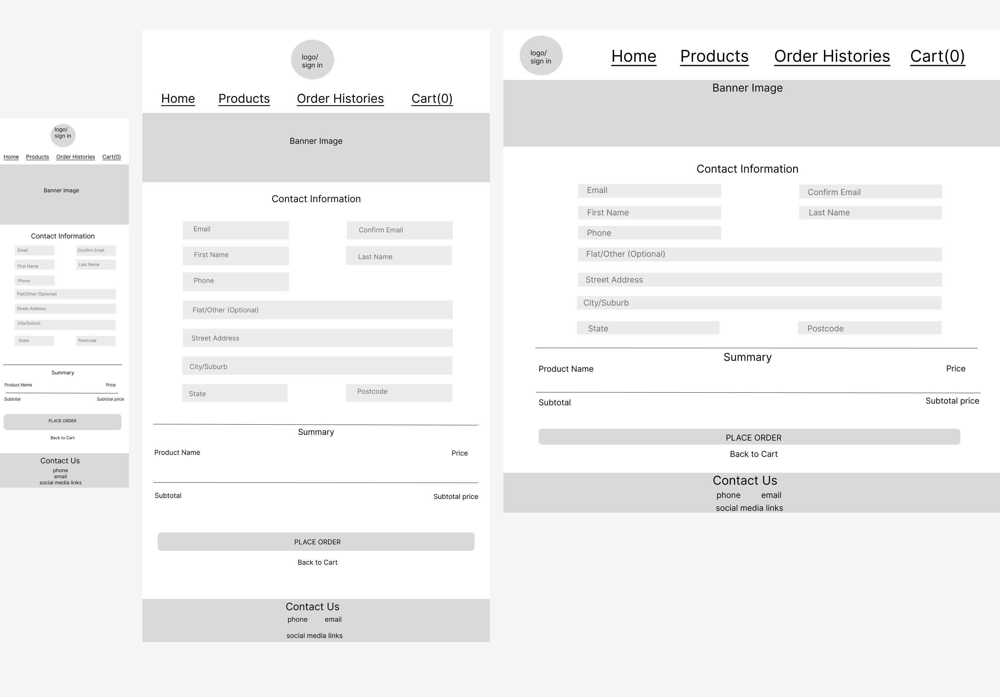
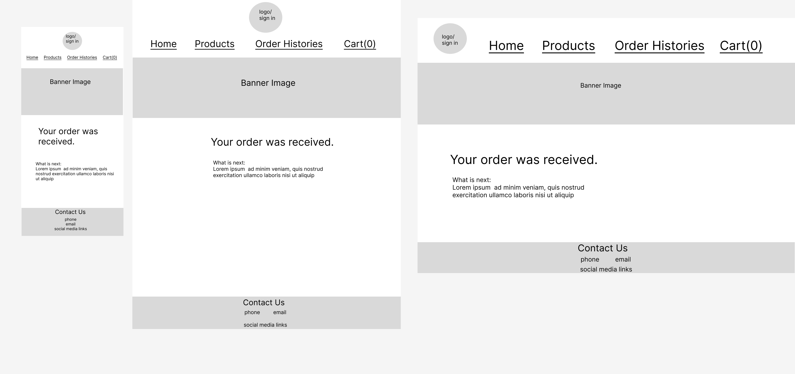
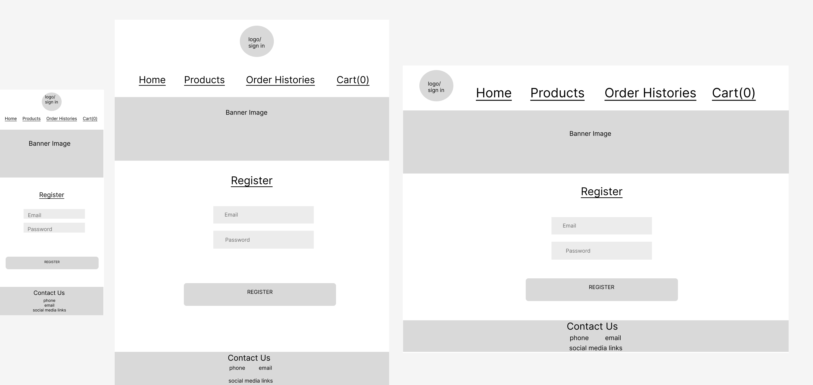
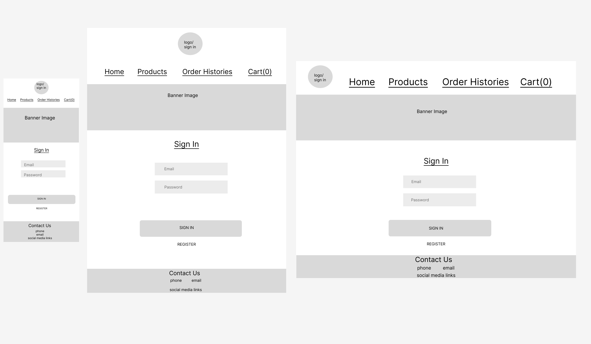
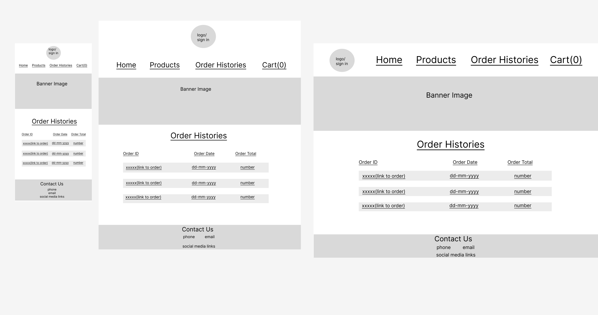
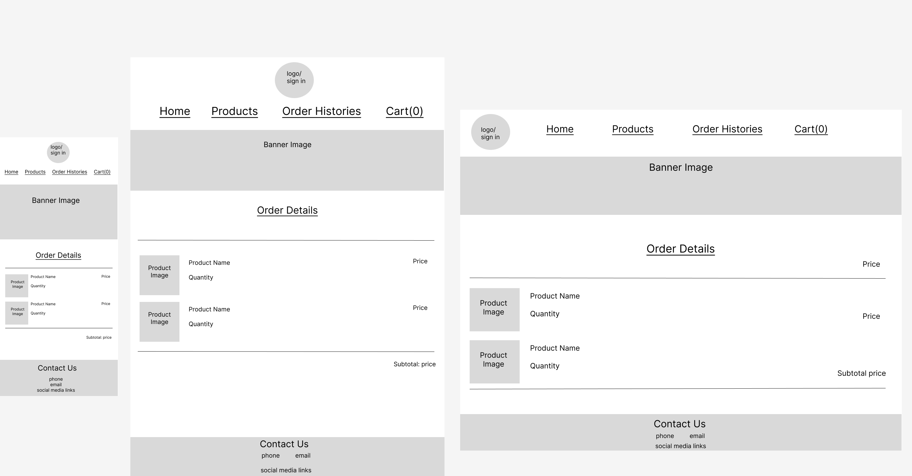

# Dan Mo and Chengqun Niu T3A2 MERN-Project-Sticker Shop

## GitHub Repo:

---

* [Part-A-Documentation](https://github.com/MERN-Project-Sticker-Shop/Part-A-Docs)
* [Part-B-Server](https://github.com/MERN-Project-Sticker-Shop/T3A2-Server)
* [Part-B-Client](https://github.com/MERN-Project-Sticker-Shop/T3A2-Client)

## Deployment:

---

* Frontend: [Frontend Deployment]
  
* Backend: [Backend Deployment](https://t3a2-server-production.up.railway.app/)
  
## Description

---

### Purpose

This project aims to develop a full-stack web application for the sticker shop that serves the following purposes:

* The website displays all of the sticker shop's products, allowing customers to view product details online.
* By creating a website, more people interested in stickers will be able find this sticker brand through a Google search, which increases shop's exposure.
* Customers could shop online and wait for the delivery at home, which saves their time.
  
### Features

This sticker shop application will have the following features:

* Customers are able to browse a list of products in the Home page and click into the link for each product to navigate to a Detail page where they can view detail information of each product 
* Customers can click 'Add to Cart' button on the Detail pages and add products into Cart
* Customers can view their cart before checking out and delete or modify numbers of each product selected
* Customers can click the 'Checkout' button on the Cart page to navigate to a Checkout page where they could fill in their addresses for delivery and place orders
* Customers can find contact info of shop owner and contact the shop if they have any questions.

Above are the basic features of the sticker shop application. Time permitting, the following feature might be implemented:

* Customers are able to register and login to view their order history

### Target audience

This app will target existing customers (mainly the scrapbookers) of the sticker shop and potential customers interested in this sticker brand. These people are targeted to view products and place orders online, which saves their time.

### Tech stack

* Front-end: HTML, CSS, JavaScript, React.js
* Back-end: Node.js, Express.js
* Database: MongoDB, Mongoose
* Deployment: Railway
* Agile Project Management: Trello
* Utilities: 
    * Lucichart (Application Architecture Diagram, Dataflow Diagram)
    * Figma (Wireframes)
* DevOps: Git, Github, VS Code

## Dataflow Diagram

---

## Application Architecture Diagram

---

## User Stories

---

### Initial user stories after kick-off meeting:

1. As a scrapbooker, I find it time-consuming to visit different brick-and-mortar craft stores or sticker shops to collect stickers. I want to browse a collection of sticker products on an online platform, so that I can easily find the products I am interested in.
2. As a scrapbooker, I sometimes need stickers in specific theme or design pattern. I want to be able to search for products I want when browsing the products, so that I find what I need faster. 
3. As a scrapbooker, I constantly need to buy new stickers. I want to be able to place orders online and have them delivered to my address, so that I can save the trouble of commuting to a brick-and-mortar sticker shop to buy what I need. 
4. As a scrapbooker, I am very picky with the design of the stickers used for scrapbooking. I want to access contact info of a sticker shop, so that when there are no satisfying products, I can describe my preferred design pattern to the shop owner and hopefully they could find matching products for me.
5. As a scrapbooker who frequently shop online, I want to view my purchase history in my own account, so that I can track products I have bought before (*this is optional and will be realised in register and sign in functions if time permits*)

### In further discussion of the usability of the web application and the UI design, additional user stories are added and extended:

6. As a scrapbooker who tends to purchase stickers in bulk, I want to be able to easily change quantity of selected stickers in my cart, so that I don't have to keep adding the same sticker to cart to get the desired quantity

7. As a scrapbooker shopping online, I want to easily access the details (description, more images, materials, etc) of the sticker products I'm interested in, so that I can have a better understanding of the products and decide if I want to purchase them.

## Wireframes

---

Each page has three designs, corresponded to the mobile, tablet and desktop view. Each page has a signin button, a nav bar, a banner image and a contact us section. The contact us section includes links to the social media. Features like customer signin, order histories will only be implemented if time permitted.

### Home

This is the landing page of our website. Customers can use the nav bar to navigate between different pages. Customers can also use the search bar in the product section to search for particular products. Customers can click the picture of the product to navigate to the products page for details.

### Product Detail

This page displays the product detail, customers can click the add to cart button to add products to the cart.

### Cart

This page displays shopping cart, customers can modify the quantity of products by entering a number in the quantity box. There is also a remove button which removes the product from cart. If customers are happy with the cart items, they can click checkout button to proceed to the checkout page. If they want to add more products, they can click continue shopping to go back to the home page for more products.

### Checkout

This page is the checkout page, which collects customers personal information for delivery and displays order summary at the bottom. After customers enters their contact information and confirms their orders, they can click place order button to place orders. Or if they want to modify cart, they can click back to cart button to go back to the cart page.

### Confirmation

This page is the confirmation page after customers place their orders. This page displays a message to notify customers that their order has been placed successfully.

### Register

This is the customer registration page, customers could enter their email address and password, then click the register button to register.

### Sign in

This is the sign in page, customers can enter their email address and password and then click the sign in button to login. If they are new customer, they can click register button to navigate to the register page for registration.

### Order Histories

This is the order histories page, customers can sign in and click order histories in the nav bar to navigate to this page. It will dislay all order histories for the logged in customer. Customers can click order ID to navigate to the order details page for order details. If customers haven't sign in, an alert will be displayed and asks customers to sign in first.

### Order Details

This page displays order details.

## Project Management with Trello

---

 Trello Board : Our Trello board can be viewed [here](https://trello.com/b/9oxdHoQc/t3a2-full-stack-app)

We took screeeshots of our Trello each day. These screenshots can be viewed [here]

---

We decided to use Kanban project methodology, which is efficient, flexible and allowed us to continously deliver our products. We achieved this by using the Kanban board on Trello.

## Implemented Application

---

The deployed application is available at [here](#deployment).

The MVP features of this application includes view product lists, view details of each product, add products to cart, modify cart items, checkout, enter address and receives an order confirmation. We also have some optional features, but we are not able to make it due to time limits. We only create a order model and routes, and we will try to implement these optional features later if we have more time.

## Libraries & Dependencies

---

* **Client**
* `react`: React is a javascript library for building user intergaces. It is based on components. We use it to build the front end(client-side) of our application.
  
* `react-dom`: React-dom is a library or package which provides DOM-specific methods and binds react to the DOM. Methods such as render() has been used to render the component of the react.
  
* `react-hook-form`: React Form Hook is a React library that is used to make and validate complex forms.
  
* `react-router-dom`: React Router DOM is a javascript library for routing in React. It allows us to implement dynamic routing in the web application. It is used to build single-page applications that acts like a multi-paged website.
  
* `@testing-library/jest-dom`, `@testing-library/react`, `@testing-library/react-hooks`, `@testing-library/user-event`: These are testing libraries used in the application. We run these tests using vitest framework.
  
* `@types/react`: This pakcage contains type definitions for React.
  
* `@types/react-dom`: This package contains type definitions for React (react-dom).
  
* `@vitejs/plugin-react-swc`: This package speeds up the vite development server with SWC.
  
* `jsdom`: JSDOM is a library which parses and interacts with assembled HTML just like a browser. It is used to create a realistic testing environment.
  
* `vite`: Vite is a build tool that significantly improves the front-end development experience. We use this to build our client-side application.
  
* `vitest`: Vitest is the unit testing framework built on top of Vite, we use this framework together with testing libraries to test our client-side application.
  
* **Server**
* `express`: Express is a Node.js web application framework for building web and mobile applications. It was used for building the backend of this applications to creates a robust API and allows for HTTP utility methods and middleware support.
  
* `cors`: CORS is a node.js package for providing a Connect/Express middleware that can be used to enable cross origin resource sharing between Express server and React client with different origin or domain. We use cros in the application to ensure both client from local version and deployed website have access to the resources.
  
* `dotnev`: Dotenv is a zero-dependency module that loads environment variables from a .env file into process.env. Environment variables like the connect url of mongo database can be safely stored in the .env file.
  
* `mongoose`: Mongoose is an Object Data Modeling (ODM) library for MongoDB and Node.js. It allows defining strongly-typed schemas to manages relationships between data and provides schema validation. We use mongoose to define our schemas and handle the interaction between our express server and cloud mongo database to manipulate data.

* `jest`: Jest is a Javascript testing framework used to create, run and structure tests. We use jest to mock the functions in the express server to create unit tests.

* `supertest`: SuperTest is a Node.js library that tests Restful APIs. It is driven by super-agent. It is used together with the testing framework jest to test the APIs of this application.
  
* `nodemon`: Nodemon is used to automatically restarting the node application when changes of the code are detected.

## Project Management and Task Delegation Methodology

---

We decided to use discord to communicate during this project. Before we start the project, we joined an audio call to divide the project into small tasks, decide the priority of each task, set up the due date of each task and assigned to each member. Each day we communicated about our progression in the morning and dicuss our plan for the day. If we faces any issues, we will join the audio call to discuss it immediately. 

We continued to use the Kanban board for part-b and task delegation. We created cards for tasks and label them with different labels, like MVP, Opional, High priority and etc. The Kanban board included several sections, backlog, to-do, doing, testing and done. Initially all cards were in the backlog section of the board, if we planned to do some of the cards, we will move them to the to-do section. When we doing that card, we will move it to the doing section, then testing section. Once it has been completed, we will move it to the done section.

We have grouped tasks into different due dates based on the priority and whether it is MVP. MVP with high priority will have earlier due date, which means we have to complete them first. Once we complete all tasks belongs to one due date(like all tasks that due on 23rd of Jan), we will have an audio call to review what we have done and discuss if there is any new tasks need to be added. If so, we will add new cards to the board. We will also review the due date for tasks that haven't started yet based on the current progression.  

Each card has been assigned to one or two members in the Kanban board, the name of the member can be seen at the bottom right part of the card. Basically, as we only have two memebers, we decided to divide the project into two parts, client-side and server-side, each will be assigned to a member. Member who are more confident with React have been assigned with the client-side, and who are more confident with APIs, express and database models have been assigned with the server-side.

## Testing

---
We have written both unit testing and integration testing for both the client and server side of the application. These tests can be run using vitest at the client side and jest and supertest at server side.

We have also down extensive user testing by ourselves during at both the development stage and production stage. During the development stage, we used postman to test the server side of the application.

* **Server**
* Integration & Unit tests:
Test coverage report is available by opening the web brower, click CMD+O and navaigate to (T3A2-PART-B-SERVER/src/coverage/Icov-report/index.html)
* Development test(Postman-Manual):
Test log and screenshots of postman testing is available at [here](docs/postman_test_log.md).

## Installation

---

* **Server**
  1. Create a directory on your machine named MERN-Sticker-Shop and $ cd into it.
  2. Whilst in the MERN-Sticker-Shop directory, from bash CLI, clone the server repo $ git clone git@github.com:MERN-Project-Sticker-Shop/T3A2-Server.git.
  3. CD into the T3A2-Server folder $ cd T3A2-Server, then cd to the src folder $ src.
  4. Install npm packages with $ npm install.
  5. Create a .env file in the src folder and add the connection url to mongo database. Example is in .env.sample file.
  6. Seed the Mongo database with the following command $ npm run seed to view dummy data in your local application.
  7. From bash run $ npm start to start the local server.
  8. The server will run on local host port 4001.

* **Client**
  1. In the MERN-Sticker-Shop directory, from bash CLI, clone the client repo $ git clone git@github.com:MERN-Project-Sticker-Shop/T3A2-Client.git
  2. CD into the T3A2-Client folder & cd T3A2-Client.
  3. Install npm packages with $ npm install.
  4. Make sure the local server is still running on port 4001.
  5. From bash CLI run $ npm run dev.
  6. The server will allow requests from local host 5173.
